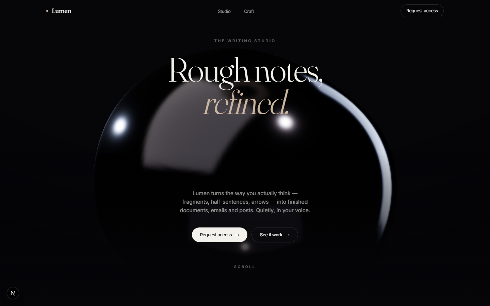
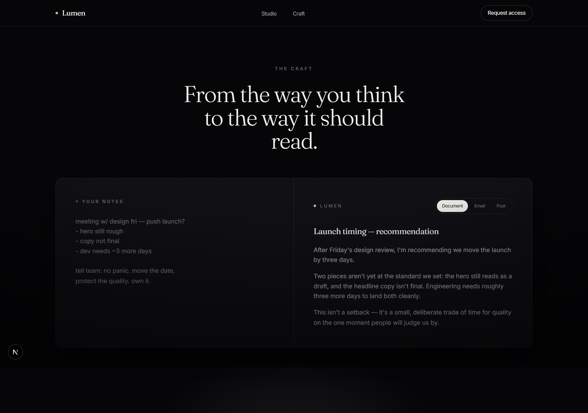
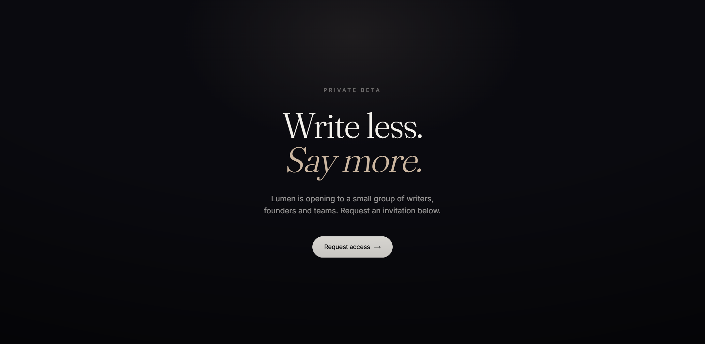

<div align="center">

# Lumen

### Rough notes, refined.

An AI writing studio that turns the way you actually think — fragments,
half-sentences, arrows — into finished documents, emails and posts.
Built as a single, art-directed launch experience: dark, cinematic, restrained.

<br />



</div>

---

## The idea

Most writing tools hand you a blank page. Lumen starts from the mess you already
have. You paste rough notes; it returns a finished piece in the form you need —
a document, an email, or a post — in your voice, not a template's.

The site itself is the pitch: a **digital showroom** for the product, framed like
a luxury performance product page rather than a generic SaaS landing.

It's a **real, working tool** — not a mockup. Paste your own notes, pick a form,
and Claude (Opus 4.8) drafts the finished piece, streaming token-by-token.

## Craft

The centre of the page is a live **notes → finished** surface. You type rough
notes into the editor, choose Document / Email / Post, and the polished result
streams in from the Claude API.

| Your notes | Lumen |
| :--- | :--- |
|  |  |

### How it works

- `app/api/refine/route.ts` — a Node route handler that calls the Anthropic SDK
  with a per-form system prompt and **streams** the response back as the model
  writes it (`client.messages.stream`, model `claude-opus-4-8`, adaptive thinking).
- `components/sections/Refine.tsx` — the client reads that stream with a
  `ReadableStream` reader and renders each chunk live, with a blinking caret.
- The system prompts are strict about preserving your facts and voice and never
  inventing details — see the route file.

## Design direction

A deliberately narrow system, applied with discipline from the first pixel to the last:

- **One near-black base**, layered surfaces, a single warm-platinum accent used
  only for hairlines and small signals — never as a fill.
- **A high-contrast luxury serif** (Fraunces) for display, a precise grotesk
  (Inter) for UI. Tight tracking, generous leading, expensive spacing.
- **Motion is subtle and elegant** — slow reveals, a controlled turntable on the
  hero, no oversized gimmicks.
- The same language continues through every section. No drift.

## The centerpiece

A liquid-chrome obsidian form, lit like a product photoshoot — a hand-placed
rig of area lights (key / rim / fill) in a dark studio, with grounding contact
shadows. Motion is controlled on purpose: a slow turn, a gentle bob, and a small
pointer-driven parallax. No free orbit, nothing chaotic.

The 3D scene is kept **entirely separate** from page layout — sections never
reach into the scene, and the scene never reaches out.

## Stack

- **Next.js 15** (App Router) · **React 19** · **TypeScript**
- **Tailwind CSS v4** (CSS-first tokens)
- **three.js** · **@react-three/fiber** · **@react-three/drei**

## Architecture

```
app/
  layout.tsx          fonts, metadata, global shell
  page.tsx            composes the sections
  globals.css         design tokens + base + utilities
components/
  three/              WebGL stage — isolated from UI
    Scene.tsx         canvas, camera, lighting rig, grounding
    Centerpiece.tsx   the liquid-chrome product + controlled motion
    StudioEnvironment.tsx   hand-placed area-light rig
    HeroCanvas.tsx    client-only loader (no SSR)
  sections/           Nav · Hero · Specs · Refine · Closing · Footer
  ui/                 Button · Reveal — small reusable primitives
lib/                  tiny helpers
```

Design decisions worth noting:

- The WebGL canvas is **client-only** (`dynamic(..., { ssr: false })`) so the
  page paints instantly and the void simply stays black while it streams in.
- The hero uses a **direct light rig in addition to the environment**, so the
  chrome reads with full specular even where image-based lighting isn't
  available (older GPUs, software WebGL).
- Everything honours **`prefers-reduced-motion`** — reveals collapse to no-ops
  and the centerpiece slows to a near-still drift.

## Run it

```bash
npm install

# Connect it to Claude:
cp .env.example .env.local        # then paste your key into .env.local
# ANTHROPIC_API_KEY=sk-ant-...    (get one at console.anthropic.com)

npm run dev
# http://localhost:3000
```

Without a key the page still runs and the editor works — the Refine button just
returns a friendly "not connected yet" message instead of a draft.

```bash
npm run build && npm start   # production
```

### Stack

Next.js 15 · React 19 · TypeScript · Tailwind v4 · three / R3F / drei (hero) ·
`@anthropic-ai/sdk` (Claude Opus 4.8, streaming).

---

<div align="center">
<sub>Write less. Say more.</sub>
</div>
